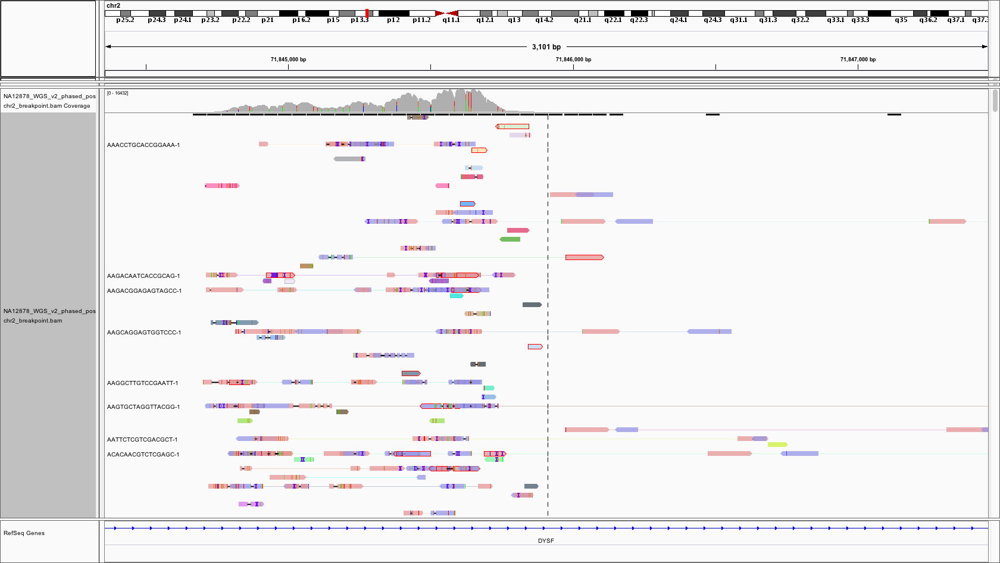
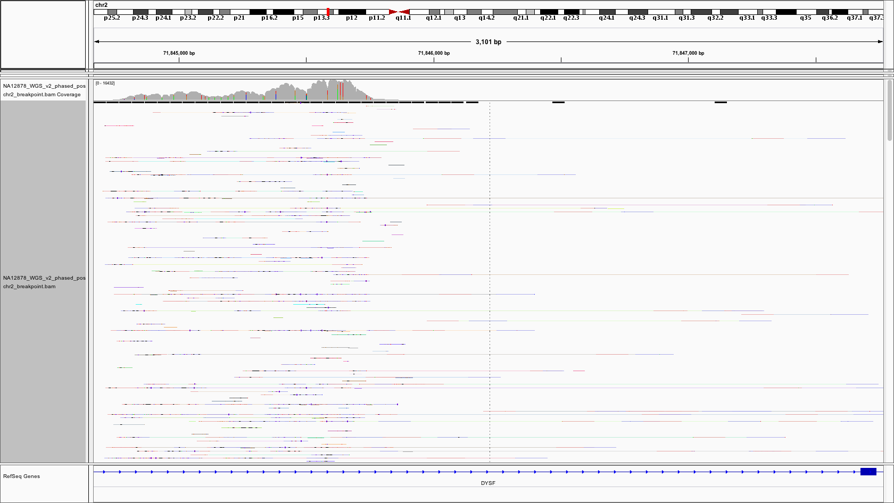
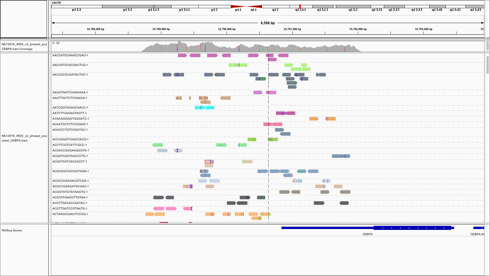
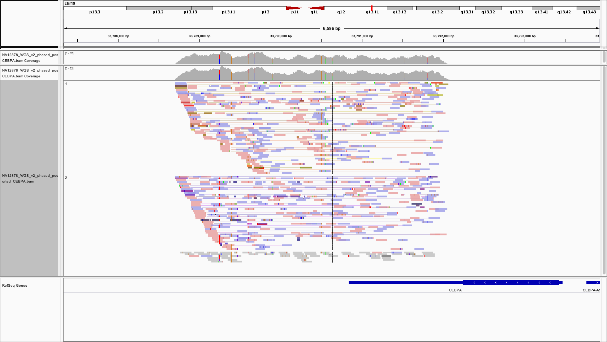
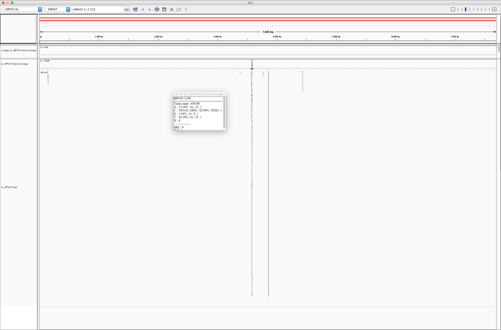

# Exploring novel insertions with 10X

Some insertions in human samples cannot be reconstructed by human genome alignment because they have an external origin, for example [oncoviruses](https://en.wikipedia.org/wiki/Oncovirus) that got integrated into a human genome. We want to explore such novel insertions and see if 10x data can help us with identifying and reconstructing those sequences as well as their integration sites.

### Contents

* [Non-10x data](#non-10x-data)
* [Strategies](#strategies)
* [Datasets](#datasets)
* [Unmapped read extraction](#unmapped-read-extraction)
* [GEMs with a high unmapped rate](#gems-with-a-high-unmapped-rate)
* [Trying de novo assembly of unmapped reads with Supernova](#trying-de-novo-assembly-of-unmapped-reads-with-supernova)
* [Extracting viral sequences](#extracting-viral-sequences)
  + [Mapping to HPV71](#mapping-to-hpv71)
  + [Trying reads with BX tags and high quality](#trying-reads-with-bx-tags-and-high-quality)
* [Viruses in COLO829](#viruses-in-colo829)

## Oncoviruses in DiploidNeverResponder

First, we experimented with a regular non-10x dataset which is was known for a high viral content. See this [document](https://github.com/umccr/oncoviruses) for the exploration details and results.

## Strategies

We considered several strategies how to utilie the 10x barcodes in order to more efficiently identify novel insertions.

1. By Oliver
	1. Extract read group (GEM) tags from unmapped reads
	2. Calculate #/% reads mapped/unmapped for each GEM in that list
	3. Identify outlier GEMs with high % of unmapped reads
	4. Blast/align reads against viral / retrotransposon reference sequences
	5. See if we can identify the integration site for any hits

2. Based on the LongRanger SV caller results (that looks for distant pairs of loci in the genome that share many more barcode than would be expected by chance, then refines the candidate SVs by comparing the layout of reads and barcodes around the event the patterns expected in deletions, inversions, duplications, and translocations to identify the SV type and find the maximum-likelihood breakpoints.)
	1. Find breakpoints with LongRanger SV caller.
	2. List reads that map in proximity with a breakpoint (in both directions), but have an unmapped mate
	3. List BX of those reads
	4. Find all unmapped reads (or reads with unmapped mate) with those barcodes
	5. De novo assemble those reads (with 10x-aware [Supernova](https://support.10xgenomics.com/de-novo-assembly/software/pipelines/latest/using/running) or Athena, or just with SPAdes)

3. Directly assembly all unmapped reads with Supernova and see what happens.

4. By https://genomemedicine.biomedcentral.com/articles/10.1186/s13073-017-0447-8: "We sought to determine whether we could resolve and thus validate the rearranged structure by de novo assembly: 
	1. We extracted all the sequence reads containing SV-specific barcodes from the linked read fastq files 
	2. and then used these subset fastq files as input to the Supernova de novo assembly program to generate contig sequences [29]. This assembler has been recently demonstrated to generate full diploid assemblies. 
	3. We visualized the structures of the resulting contigs by plotting the mapping position of each SV-specific read in the genome versus its mapping position in the contig."

We are going to start exploring with the first strategy.


## Datasets

We are working with 2 10x samples: [NA12878_WGS downloaded from the 10x website](https://support.10xgenomics.com/genome-exome/datasets/2.2.1/NA12878_WGS_v2), and cancer COLO829-10x sequenced in UMCCR. Both datasets were pre-processed with LongRanger to get `NA12878_WGS_v2_phased_possorted_bam.bam` and `COLO829-10x_phased_possorted_bam.bam` barcode-aware GRCh37 BAM files.

We are using the following conda environment for the following processing: bioconda's `sambamba samtools pigz parallel bxtools blast snakemake spades bioawk` + `supernova` and `ema` (installed in extras). We work in the following folder on Raijin:

```
cd /g/data3/gx8/projects/Saveliev_10X/COLO829-10x/insertions
cd /g/data3/gx8/projects/Saveliev_10X/NA12878-10x/insertions
```


## Extracting unmapped read

Reads from novel insertions are expected to end up as "unmapped" in a human genome BAM file file, so we start the analysis by getting reads unmapped to the human genome, as well as the reads unmapped mates which can support integration breakpoints.

```
mkdir unmapped_or_mate_is_unmapped
sambamba view -f bam -F "unmapped or mate_is_unmapped" -t 20 COLO829-10x_phased_possorted_bam.bam | sambamba sort -n -t {threads} -m 100G /dev/stdin --show-progress > unmapped_or_mate_is_unmapped/COLO829-10x.namesorted.bam
```


## Exploring unmapped GEMs

Split by BX tag:

```
cd unmapped_or_mate_is_unmapped
mkdir bx_split
bxtools split COLO829-10x.bam -a bx_split/COLO829-10x -m 1000 > bx_split/COLO829-10x_bx_counts.txt
```

Extract tags with at least 1000 reads:

```
sort -k 2 -r -n NA12878_WGS_bx_counts.txt | py -x "x if int(x.split()[1]) >= 1000 else None" > NA12878_WGS_bx_counts_cnt1000.txt
sort -k 2 -r -n COLO829-10x_bx_counts.txt | py -x "x if int(x.split()[1]) >= 1000 else None" > COLO829-10x_bx_counts_cnt1000.txt
```

Count all reads in full BAM by BX:

```
bxtools stats /data/cephfs/punim0010/projects/Saveliev_10X/NA12878-10x/NA12878_WGS_v2_phased_possorted_bam.bam > /data/cephfs/punim0010/projects/Saveliev_10X/NA12878-10x/qc/NA12878_WGS_v2_phased_possorted_bam.bxstats.txt

bxtools stats /data/cephfs/punim0010/projects/Saveliev_10X/NA12878-10x/NA12878_WGS_v2_phased_possorted_bam.bam > /data/cephfs/punim0010/projects/Saveliev_10X/NA12878-10x/qc/NA12878_WGS_v2_phased_possorted_bam.bxstats.txt
```

Extract BX with many unmapped:

```
grep -f <(cut -f1 NA12878_WGS_bx_counts_cnt1000.txt) /data/cephfs/punim0010/projects/Saveliev_10X/NA12878-10x/qc/NA12878_WGS_v2_phased_possorted_bam.bxstats.txt > NA12878_WGS_full_bx_stats_cnt1000.txt
```

(Optionally, we can split the full BAM by BX tag:)

```
bxtools split NA12878_WGS_v2_phased_possorted_bam.bam -a bx_split/NA12878_WGS -m 1000 > bx_split/NA12878_WGS_bx_counts.txt
```

The following barcodes have at least 1000 unmapped reads or reads with unmapped mate:

```
                     Aln  Unaln | Mate unaln  Unaln  Aln & Mate unaln   IS  MQ
CATGTAGAGTCGTACT-1  4037              94.70% 94.43%                11  237  60
GCCTGTTAGCCCGTGT-1  1342              86.44% 85.77%                 9  348  60
ACTGTAGGTTCGTAAC-1  1647              84.03% 83.79%                 4  347  60
CATGTAGGTAGATGTA-1  1250              84.00% 83.28%                 9   19  19
GCCTGTTGTTCGCGGT-1  1921              73.30% 72.98%                 6  348  60
CATGTAGAGAGTCTCT-1  1828              72.87% 72.10%                14   20  15
GCCTGTTGTCTTACCC-1  1827              72.03% 71.65%                 7  374  60
GCCTGTTAGTCGAGTG-1  1515              69.37% 68.84%                 8  349  60
TCAGTAGGTCATGTAC-1  2070              69.47% 68.41%                22  304  60
GCCTGTTAGCTCCGTG-1  1714              68.14% 67.74%                 7  368  60
ACTGTAGAGGTAAACT-1  1507              67.09% 66.42%                10   20  19
GCCTGTTAGGCCCTCA-1  3324              63.96% 63.45%                17  308  60
CATGTAGGTTGATCAC-1  1649              63.61% 62.77%                14  315  60
GCCTGTTGTTTCGTTT-1  1933              63.68% 62.44%                24  322  60
GCCTGTTAGTCGGCTC-1  2126              61.90% 61.43%                10  339  60
GCCTGTTGTTTGGCTA-1  1921              64.29% 56.95%               141  314  60
TGCGCAGGTACTGTAC-1  2327              56.81% 55.82%                23  334  60
GCCTGTTGTCCGGGTT-1  2053              52.70% 50.02%                55  288  49
GCCTGTTGTACGTTTG-1  2316              50.69% 50.00%                16  286  60
AAGCCCGCATCCCACT-1  2524              41.32% 37.08%               107  264  20
GTGCCTTCAGATCTGT-1  7461              21.61% 20.68%                69  336  60
GTTGCAACAGATCTGT-1  5943              19.60% 15.01%               273  329  60
```

For each tag, we extract mapped reads with unmapped mates:

```
!cd /data/cephfs/punim0010/projects/Saveliev_10X/COLO829-10x/insertions/unmapped_or_mate_is_unmapped/split_by_bx/

for tag in df.index:
    !sambamba view -F "not unmapped and mapping_quality >= 60" NA12878_WGS.{tag}-1.bam -f bam | samtools sort > NA12878_WGS.{tag}-1.mapped.bam
```

Manually reviewing the reads, we can find one BX with mapped reads spanning consistently more or less one region (possibly a breakpoint?)

```
samtools view NA12878_WGS.GCCTGTTGTTTCGTTT-1.mapped.bam

ST-E00273:259:H7WY3ALXX:1:1217:21207:15479  121 chr2  71844818  60  73M1D11M2I30M4D12M  chr7  128046340  0
ST-E00273:259:H7WY3ALXX:1:1220:8156:43677    73 chr2  71844971  60  47M6I7M2I66M        chr10    654413  0
ST-E00273:259:H7WY3ALXX:2:1118:11373:44152   73 chr2  71845284  60  52M13I2M1D61M       chr21  44035538  0
ST-E00273:259:H7WY3ALXX:1:2121:15006:67814   89 chr2  71845342  60  14S54M7I53M         =      33141434  0
ST-E00273:259:H7WY3ALXX:3:2117:1499:37664    89 chr2  71845402  60  77M2I22M1I17M1D9M   =      71845700  0
ST-E00273:259:H7WY3ALXX:1:1112:18913:57038  169 chr2  71845409  60  7M2I66M76S          *             0  0
ST-E00273:259:H7WY3ALXX:1:2124:12134:1977    73 chr2  71845440  60  79M2D21M1D24M4S     chr20  25048324  0
ST-E00273:259:H7WY3ALXX:2:1106:10602:14828  153 chr2  71845521  60  30S25M2I40M1D13M41S *             0  0
ST-E00273:259:H7WY3ALXX:2:1105:1458:67937    89 chr2  71845525  60  35S93M              chr4   72052386  0
ST-E00273:259:H7WY3ALXX:1:2203:29985:65001   89 chr2  71845588  60  9S78M2D29M2D12M     =      71844822  0
ST-E00273:259:H7WY3ALXX:3:2207:11921:48230  153 chr2  71845590  60  75S54M7I15M         *             0  0
ST-E00273:259:H7WY3ALXX:1:2120:18832:35801   89 chr2  71845617  60  46M2D79M3S          =      71845704  0
ST-E00273:259:H7WY3ALXX:1:2204:30888:68430   73 chr2  71845848  60  6S86M36S            hs37d5 31586471  0
ST-E00273:259:H7WY3ALXX:1:2204:18913:24198   73 chr4  53065963  60  23M4I19M3D38M44S    chr15  79384471  0
ST-E00273:259:H7WY3ALXX:1:1104:28270:7181   121 chr14 32925056  60  128M                chr1   30986160  0
ST-E00273:259:H7WY3ALXX:2:1101:22110:57899   73 chr14 32966430  60  128M                chr13  52303476  0
ST-E00273:259:H7WY3ALXX:2:2103:30452:36311   89 chr14 33028682  60  128M                chr18  71871932  0
ST-E00273:259:H7WY3ALXX:3:2201:23977:47316  105 chr21 28080947  60  128M                chr5   77330570  0
```

Now get all reads for that tag to see if they localized at the same region, then we'll see it in IGV:

```
cd /data/cephfs/punim0010/projects/Saveliev_10X/NA12878-10x
bamtools filter -tag BX:GCCTGTTGTTTCGTTT-1 -in NA12878_WGS_v2_phased_possorted_bam.bam -out NA12878_WGS_v2_phased_possorted_bam-GCCTGTTGTTTCGTTT-1.bam
```

Extract that region to download locally on IGV:

```
sambamba slice NA12878_WGS_v2_phased_possorted_bam.bam chr2:71844818-71847848 -o NA12878_WGS_v2_phased_possorted_chr2_breakpoint.bam
```

Extracting this one to for comparison:

```
sambamba slice NA12878_WGS_v2_phased_possorted_bam.bam chr19:33788840-33791956 -o NA12878_WGS_v2_phased_possorted_CEBPA.bam

```

In the large SVs file downloaded from the 10x website, we can find those SVs called with LOWQ: `/data/cephfs/punim0010/projects/Saveliev_10X/NA12878-10x/longranger/downloaded/NA12878_WGS_v2_large_svs.vcf.gz`

```
chr2   72650821  call_2031    A  <INV>                 5  LOWQ  END=72704553;CIEND=0,1;CIPOS=0,1;SVTYPE=INV;SVLEN=53732;PS=71845775;HAP_ALLELIC_FRAC=0.25;ALLELIC_FRAC=0.0200501253133;PAIRS=1;SPLIT=0;WildCov=.;MolTtl=.;MolTtlNoR=.;MolDel=.
chr2   72790392  call_3830    A  <DUP:TANDEM>          3  LOWQ  END=72858227;CIEND=0,1;CIPOS=0,1;SVTYPE=DUP;SVLEN=67835;PS=71845775;HAP_ALLELIC_FRAC=0.230769230769;ALLELIC_FRAC=0.00617283950617;PAIRS=1;SPLIT=0;WildCov=.;MolTtl=.;MolTtlNoR
chr2   73124465  call_2875    G  <INV>                 4  LOWQ  END=73195439;CIEND=-24,25;CIPOS=-24,25;SVTYPE=INV;SVLEN=70974;PS=71845775;HAP_ALLELIC_FRAC=0.153846153846;ALLELIC_FRAC=0.0128755364807;PAIRS=2;SPLIT=0;WildCov=.;MolTtl=.;MolT
chr2   73877193  call_2032    A  <UNK>                 5  LOWQ  END=73940170;CIEND=-8,8;CIPOS=-6,6;SVTYPE=UNK;SVLEN=62977;PS=71845775;HAP_ALLELIC_FRAC=0.172413793103;ALLELIC_FRAC=0.0178173719376;PAIRS=3;SPLIT=0;WildCov=.;MolTtl=.;MolTtlNo
chr2   76051830  call_840     C  <INV>                 8  LOWQ  END=76110415;CIEND=0,1;CIPOS=0,1;SVTYPE=INV;SVLEN=58585;PS=71845775;HAP_ALLELIC_FRAC=0.228571428571;ALLELIC_FRAC=0.0220264317181;PAIRS=1;SPLIT=0;WildCov=.;MolTtl=.;MolTtlNoR=
chr2   76213102  call_2033    A  <INV>                 5  LOWQ  END=76259489;CIEND=0,1;CIPOS=0,1;SVTYPE=INV;SVLEN=46387;PS=71845775;HAP_ALLELIC_FRAC=0.192307692308;ALLELIC_FRAC=0.0216216216216;PAIRS=1;SPLIT=0;WildCov=.;MolTtl=.;MolTtlNoR=
chr2   78278376  call_3831    T  <INV>                 3  LOWQ  END=78322534;CIEND=0,1;CIPOS=0,1;SVTYPE=INV;SVLEN=44158;PS=71845775;HAP_ALLELIC_FRAC=0.103448275862;ALLELIC_FRAC=0.0113314447592;PAIRS=1;SPLIT=0;WildCov=.;MolTtl=.;MolTtlNoR=
chr2   78415466  call_2876    A  <UNK>                 4  LOWQ  END=78476352;CIEND=-9,9;CIPOS=-9,9;SVTYPE=UNK;SVLEN=60886;PS=71845775;HAP_ALLELIC_FRAC=0.137931034483;ALLELIC_FRAC=0.0176767676768;PAIRS=3;SPLIT=0;WildCov=.;MolTtl=.;MolTtlNo
chr2   78887169  call_3832    G  <INV>                 3  LOWQ  END=78950399;CIEND=0,1;CIPOS=0,1;SVTYPE=INV;SVLEN=63230;PS=71845775;HAP_ALLELIC_FRAC=0.111111111111;ALLELIC_FRAC=0.00973236009732;PAIRS=1;SPLIT=0;WildCov=.;MolTtl=.;MolTtlNoR
chr2   79106744  call_3833    A  <UNK>                 3  LOWQ  END=79159256;CIEND=-30,31;CIPOS=-30,31;SVTYPE=UNK;SVLEN=52512;PS=71845775;HAP_ALLELIC_FRAC=0.2;ALLELIC_FRAC=0.0171568627451;PAIRS=2;SPLIT=0;WildCov=.;MolTtl=.;MolTtlNoR=.;Mol
chr2   80313256  call_1487    T  <INV>                 6  LOWQ  END=80353748;CIEND=-15,15;CIPOS=-15,15;SVTYPE=INV;SVLEN=40492;PS=71845775;HAP_ALLELIC_FRAC=0.25;ALLELIC_FRAC=0.0263157894737;PAIRS=2;SPLIT=0;WildCov=.;MolTtl=.;MolTtlNoR=.;Mo
```

Viewing in IGV: `chr2:71,844,732-71,845,762`



"Show BX" mode:


For comparison, this is how a regular region looks:






## Extracting reads with BX tags and high quality

Here, we swtich to the strategy with performed with DiploidNeverResponder sample, and will use cancer COLO829-10x sample.

We use the `assemble/filter_bam.py` script to extract long high-quality reads (length >= 125, average qual >= 25, minimal quality >= 10, correct BX tags), and their mates:

```
mkdir with_bx_lng_hqual
./filter_bam.py COLO829-10x.namesorted.bam with_bx_lng_hqual/COLO829-10x.bam --10x
samtools stats COLO829-10x.bam > COLO829-10x.stats

cd with_bx_lng_hqual
samtools fastq COLO829-10x.bam -1 COLO829.R1.fq -2 COLO829.R2.fq -s COLO829.single.fq
[M::bam2fq_mainloop] discarded 10657 singletons
[M::bam2fq_mainloop] processed 75224563 reads
```


## Viral content

Aligning against the viral database:

```
bwa mem -t 5 /g/data3/gx8/extras/vlad/bcbio/genomes/Hsapiens/GRCh37/viral/gdc-viral.fa COLO829.R1.fq COLO829.R2.fq | bamsort inputthreads=5 outputthreads=5 inputformat=sam index=1 indexfilename=viral_mapping/COLO829_viral.bam.bai O=viral_mapping/COLO829_viral.bam

samtools idxstats viral_mapping/COLO829_viral.bam | awk 'BEGIN {OFS="\t"} {print $1, $2, $3, ($2 != 0) ? $3/$2*150 : 0 }' | sort -nr -k4,4 | head | cols

virus  size  reads  covearge 
HPV71  8037  172533  3220.1
HPV47  7726  110295  2141.37
HCV-2  9711  127975  1976.75
HPV82  7870   60355  1150.35
HCV-1  9646   71112  1105.83
HIV-1  9181   24792  405.054
HPV42  7917   19058  361.084
HPV20  7757   17376  336.006
HPV21  7779   15443  297.782
HPV51  7808   14408  276.793
```

Many viruses have a very high coverage in the unmapped reads or reads with unmapped rate. HPV71 seems to be self-amplified heavily like HPV18 in the DiploidNeverResponder sample, however [HPV71 is not cancerogenic](https://www.ncbi.nlm.nih.gov/pmc/articles/PMC3690501/). So we will explore the second most abundant virus here - HPV47.


## HPV47

Aligning reads to HPV47 only:

```
samtools faidx /g/data3/gx8/extras/vlad/bcbio/genomes/Hsapiens/GRCh37/viral/gdc-viral.fa HPV47 > viral_mapping/HPV47.fa
bwa index viral_mapping/HPV47.fa

bwa mem -t 5 viral_mapping/HPV47.fa COLO829.R1.fq COLO829.R2.fq | bamsort inputthreads=5 outputthreads=5 inputformat=sam index=1 indexfilename=viral_mapping/COLO829_HPV47.bam.bai O=viral_mapping/COLO829_HPV47.bam

samtools stats viral_mapping/COLO829_HPV47.bam > viral_mapping/COLO829_HPV47.stats

samtools idxstats viral_mapping/COLO829_HPV47.bam | awk 'BEGIN {OFS="\t"} {print $1, $2, $3, ($2 != 0) ? $3/$2*150 : 0 }' | sort -nr -k4,4 | head | cols
# HPV71  8037  84420  1575.59
```

### De-novo assembling HPV47 region

Getting reads that map to HPV18 and all their mate that might point us to an integration site:

```
cd /g/data3/gx8/projects/Saveliev_10X/COLO829-10x/insertions/unmapped_or_mate_is_unmapped/with_bx_lng_hqual/viral_mapping

samtools view COLO829_viral.bam HPV47 -O bam > to_HPV47.bam

samtools sort -n to_HPV47.bam -O bam > to_HPV47.namesorted.bam

samtools fastq to_HPV47.namesorted.bam -1 to_HPV47.R1.fq -2 to_HPV47.R2.fq -s to_HPV47.single.fq
```

Assembling with SPAdes:

```
spades.py --only-assembler -1 to_HPV47.R1.fq -2 to_HPV47.R2.fq -s to_HPV47.single.fq -o spades

# QC the assembly - stats and alignment back to HPV47
quast.py spades/contigs.fasta -R HPV47.fa -o spades/quast --ref-bam to_HPV47.namesorted.bam --no-read-stats --no-sv -1 to_HPV47.R1.fq -2 to_HPV47.R2.fq --debug

# Align contigs to the reference:
minimap2 -a HPV47.fa spades/contigs.fasta | samtools sort > spades/contigs_to_HPV47.bam && samtools index spades/contigs_to_HPV47.bam
```



We see that all reads are piled up to a single small CAA repeat.

Thoughts on that:

1. We should exclude secondary, duplicate, and low-quality alignments from the unmapped BAM.
2. We should exclude short aligments from viral BAM.
2. We should not only count the mapped reads, but also calculate the sequence coverage completeness.

### Extra filtering of unmapped

```
less COLO829-10x.stats
SN      sequences:             75182853
SN      reads mapped:          24223170
SN      reads mapped and paired:      0       # paired-end technology bit set + both mates mapped
SN      reads unmapped:        50959683
SN      reads paired:   		 75182853       # paired-end technology bit set
SN      reads duplicated:       6448345       # PCR or optical duplicate bit set
SN      reads MQ0:              2975983       # mapped and MQ=0
SN      reads QC failed:              0
SN      non-primary alignments: 5252162

~/bin/sambamba view -f bam -F "not secondary_alignment and not failed_quality_control and not duplicate" COLO829-10x.bam -o COLO829-10x.good_alignment.bam

samtools stats COLO829-10x.good_alignment.bam > COLO829-10x.good_alignment.stats

samtools sort -n COLO829-10x.good_alignment.bam -O bam > COLO829-10x.good_alignment.namesorted.bam

samtools fastq COLO829-10x.good_alignment.namesorted.bam -1 COLO829-10x.good_alignment.R1.fq -2 COLO829-10x.good_alignment.R2.fq -s COLO829-10x.good_alignment.single.fq

# Aligning to viruses
bwa mem -t 10 /g/data3/gx8/extras/vlad/bcbio/genomes/Hsapiens/GRCh37/viral/gdc-viral.fa COLO829-10x.good_alignment.R1.fq COLO829-10x.good_alignment.R2.fq  | bamsort inputthreads=10 outputthreads=10 inputformat=sam index=1 indexfilename=viral_mapping/COLO829_good_alignment_viral.bam.bai O=viral_mapping/COLO829_good_alignment_viral.bam

samtools stats viral_mapping/COLO829_good_alignment_viral.bam > viral_mapping/COLO829_good_alignment_viral.stats

samtools idxstats viral_mapping/COLO829_good_alignment_viral.bam | awk 'BEGIN {OFS="\t"} {print $1, $2, $3, ($2 != 0) ? $3/$2*150 : 0 }' | sort -nr -k4,4 | head | cols
HPV71  8037  171999  3210.13
HPV47  7726  110291  2141.3
HCV-2  9711  127390  1967.72
HPV82  7870   59678  1137.45
HCV-1  9646   70707  1099.53
HIV-1  9181   24827  405.626
HPV42  7917   19194  363.66
HPV20  7757   17325  335.02
HPV21  7779   15484  298.573
HPV51  7808   14453  277.658
```

The results are still quite similar. (TODO: try the updates to `filter_unmapped_bam.py`: remove pairs where the mapped read is low quality)

### Extra filtering of viral BAM

We also try to do extra filtering of the viral BAM: remove very short alignments (below 60):

```
python filter_viral_bam.py viral_mapping/COLO829_good_alignment_viral.bam viral_mapping/COLO829_good_alignment_viral.GOOD.bam

samtools idxstats viral_mapping/COLO829_good_alignment_viral.long_alignments.bam | awk 'BEGIN {OFS="\t"} {print $1, $2, $3, ($2 != 0) ? $3/$2*150 : 0 }' | sort -nr -k4,4 | head

HCV-2   9711    53762   830.429
HCV-1   9646    11800   183.496
HPV71   8037    9781    182.549
HPV82   7870    328     6.25159
HPV6    7996    148     2.77639
KSHV    137969  629     0.683849
HPV19   7685    33      0.644112
HPV20   7757    3       0.0580121
HPV21   7779    2       0.0385654
HPV73   7700    1       0.0194805
```

We can see that `HPV47` just disappears from the list. However, we want to go futher, and also calculate the fraction of the virus covered with reads.

### Viral coverage completeness

We use mosdepth to check what percentage of the viral sequence is covered by at least 5 bases:

```
mosdepth COLO829_good_alignment_viral COLO829_good_alignment_viral.bam
cat COLO829_good_alignment_viral.mosdepth.global.dist.txt | grep -w 5 | sort -r -k3,3 | less
HPV71   5       0.03
HPV82   5       0.02
HPV77   5       0.02
HPV73   5       0.02
HPV72   5       0.02
HPV6    5       0.02
HPV62   5       0.02
HPV56   5       0.02
HPV51   5       0.02
HPV43   5       0.02
HPV34   5       0.02
HPV26   5       0.02
HPV21   5       0.02
HPV20   5       0.02
HPV14   5       0.02
HPV114  5       0.02
HCV-1   5       0.02
```

Only viruses above have a coverage above 2%. And if we take only long alignments, we will get almost nothing:

```
HPV82   5       0.01
HPV71   5       0.01
HPV6    5       0.01
HPV19   5       0.01
HCV-2   5       0.01
HCV-1   5       0.01
KSHV    5       0.00
```

Or more advanced (on diploid example)

```
mosdepth diploid_tumor_viral_mosdepth diploid_tumor_viral.bam -n --thresholds 1,5,25 --by <(awk 'BEGIN {FS="\t"}; {print $1 FS "0" FS $2}' /g/data/gx8/local/development/bcbio/genomes/Hsapiens/GRCh37/viral/gdc-viral.fa.fai)
echo '#virus\tsize\tdepth\t1x\t5x\t25x'
paste <(zcat diploid_tumor_viral_mosdepth.regions.bed.gz) <(zgrep -v ^# diploid_tumor_viral_mosdepth.thresholds.bed.gz) | awk 'BEGIN {FS="\t"} { print $1 FS $3 FS $4 FS $9/$3 FS $10/$3 FS $11/$3}' | sort -n -r -k 5,5
HPV18  7857  2265.23  1           1           0.931144
HCV-1  9646  1.93     0.0125441   0.0101597   0.0096413
HCV-2  9711  2.68     0.0109155   0.00998867  0.00957677
HPV71  8037  7.78     0.0121936   0.00970511  0.00783875
HPV19  7685  1.02     0.00962915  0.0093689   0.00845804
HPV82  7870  0.66     0.00991105  0.00762389  0.00508259
HPV20  7757  0.18     0.012247    0.00747712  0.00360964
HPV21  7779  0.22     0.0154261   0.00694177  0.00578481
HPV25  7713  0.11     0.00700117  0.00609361  0
HPV14  7713  0.05     0.00777907  0.00544535  0
```


### NA12878-10x

Same for another sample:

```
mosdepth NA12878_viral NA12878_viral.bam -n
cat NA12878_viral.mosdepth.dist.txt | grep -w 5 | sort -r -k3,3 | tsv
HPV73     5  0.08
HPV87     5  0.01
HPV83     5  0.01
```

Only one virus has completeness above 1% on 5x, and that's even before long alignment filtering.


## Playground

### NA12878: extracting reads with BX tags and high quality

NA12878_WGS read counts:

```
unmapped_or_mate_is_unmapped/NA12878_WGS.bam:  20,876,086 sequences
samtools view -c                               21,750,049  
```

Can we merge all bins from `bxtools split`?

```
cd unmapped_or_mate_is_unmapped
bxtools split NA12878_WGS.bam -a bx_split/NA12878_WGS -m 1000 > bx_split/NA12878_WGS_bx_counts.txt
cd bx_split
parallel -j30 "bedtools bamtofastq -i {} -fq {/.}.R1.fq -fq2 {/.}.R2.fq 2>unpaired/{/.}.unpaired" ::: *-1.bam
cd ..
cat bx_split/*R1.fq > NA12878_WGS.bx_only.R1.fq
cat bx_split/*R2.fq > NA12878_WGS.bx_only.R2.fq
```

Getting total 6_401_804 out of 10_438_043 read pairs - looks quite low.

Aligning to the viral fasta:

```
<see commands above>
# Real time: 36.679 sec; CPU: 361.046 sec

name   mapped  coverage         divide by 809965400/1000000000 = 0.8099654 billion reads in genome
HPV71   23552  2.93044668409    3.6179899587
HPV47   10623  1.37496764173
HPV82    7395  0.939644218551
HPV42    4697  0.593280282935
HPV51    4107  0.52599897541
HPV105   1973  0.257336637537
HPV20    1785  0.230114735078
HPV102   1522  0.188412973508
HPV21    1372  0.176372284355
CMV     40204  0.170611849978
```

And to HPV71 only:

```
<see commands above>
# HPV71  30645  3.81298992161
```

Unfortunately, getting a much lower coverage from BX reads (3,8 vs 12,7).

Perhaps we shouldn't be relying on bxtools stats method to get reads with BX. It's weird that summing up values from `bxtools stats` do not match the value above (`6401804 * 2 = 12_803_608` vs `19_613_313` by `cut -f2 NA12878_WGS.bam_bx_stats.txt | awk '{s+=$1} END {print s}'`)

Trying to use pysam to filter reads with BX:

```
mkdir with_bx ; mkdir with_bx_lng_hqual
./filter_bam.py NA12878_WGS.bam

Total:                  21,750,049
bx_i:                   19,613,313
lng_i:                  20,876,724
hqual_i:                 5,639,761
bx_hqual_i:              5,202,715
lng_hqual_i:             4,998,924
bx_lng_hqual_i:          4,632,339
paired_i:               21,750,049
paired_hqual_i:          5,639,761
paired_lng_hqual_i:      4,998,924
paired_bx_hqual_i:       5,202,715
paired_bx_lng_hqual_i:   4,632,339

cd with_bx
samtools fastq -f 1 -F 1536 NA12878_WGS.bam -1 NA12878_WGS.R1.fq -2 NA12878_WGS.R2.fq -s NA12878_WGS.single.fq
NA12878_WGS.R1.fq      - 1,083,568 reads
NA12878_WGS.R2.fq      - 1,083,568 reads
NA12878_WGS.single.fq - 15,865,113 reads

cd with_bx_lng_hqual
samtools fastq -f 1 -F 1536 NA12878_WGS.bam -1 NA12878_WGS.R1.fq -2 NA12878_WGS.R2.fq -s NA12878_WGS.single.fq
NA12878_WGS.R1.fq -         56,907 reads 
NA12878_WGS.R2.fq -         56,907 reads
NA12878_WGS.single.fq -  4,264,669 reads  
```

Trying aligning to viral data again. With BX only:

```
HPV71   3622  0.45066567127        0.5555792877
HPV82   1825  0.231893265565
HPV47   1378  0.178358788506
HPV51    859  0.110015368852
HPV105   706  0.0920829529151
HPV42    684  0.0863963622584
HPV102   604  0.0747709829166
HPV6     308  0.0385192596298
KSHV    5184  0.0375736578507
HPV21    281  0.0361228949736
```

With BX and long and high quality:

```
HPV71   160  0.019907925843        0.0248849073
HPV82   155  0.0196950444727
HPV6    125  0.0156328164082
HPV102   90  0.0111413716266
HPV42    58  0.00732600732601
HPV51    50  0.00640368852459
HPV34    26  0.00336656739609
HPV32    24  0.00301469664615
HPV59    20  0.00253292806484
HPV68    18  0.00230120173869
```

Long and high quality only:

```                                
HPV71   186  0.0231429637925       0.02857156024
HPV82   161  0.020457433291
HPV6    146  0.0182591295648
HPV102  110  0.0136172319881
HPV51    64  0.00819672131148
HPV42    64  0.00808387015284
HPV34    30  0.00388450084164
HPV68    26  0.00332395806699
HPV32    26  0.00326592136666
HPV73    20  0.0025974025974
```

Getting highly mapped reads from the HPV71 bin.

With BX only:

```
HPV71  2529  0.314669652856  
```

With BX and high quality:

```
HPV71  20  0.00248849073037  
```

With BX and long and high quality:

```
HPV71  0         
```

With BX only:

```
HPV71  24  0.00298618887645  
```


### NA12878: searching in viral databases

Searching viral sequences using 3 different approaches.

- Using Mash (http://mash.readthedocs.io/en/latest/tutorials.html)

```
mash sketch /g/data3/gx8/extras/vlad/bcbio/genomes/Hsapiens/GRCh37/viral/gdc-viral.fa -i -o mash/gdc-viral
mash screen gdc-viral.msh ../NA12878_WGS_S1_L001_R1_001.fastq ../NA12878_WGS_S1_L001_R2_001.fastq > screen_gdc.tab
sort -gr screen_gdc.tab | head
```

Also against RefSeq:

```
mash screen refseq.genomes.k21s1000.msh ../NA12878_WGS_S1_L001_R1_001.fastq ../NA12878_WGS_S1_L001_R2_001.fastq > screen_refseq.tab
```

- Kraken against the minikraken database (http://ccb.jhu.edu/software/kraken/MANUAL.html)

```
kraken --preload --db /g/data3/gx8/extras/kraken/minikraken_20171019_8GB --fastq-input NA12878_WGS_S1_L001_R1_001.fastq --threads 9 --out kraken/kraken_out --min-hits 2 --quick
```

- Aligning against the viral database:

```
bwa mem -t 9 /g/data3/gx8/extras/vlad/bcbio/genomes/Hsapiens/GRCh37/viral/gdc-viral.fa COLO829-10x_S1_L001_R1_001.fastq COLO829-10x_S1_L001_R2_001.fastq | bamsort inputthreads=9 outputthreads=9 inputformat=sam index=1 indexfilename=viral_mapping/COLO829_viral.bam.bai O=viral_mapping/COLO829_viral.bam

samtools idxstats viral_mapping/COLO829_viral.bam | awk 'BEGIN {OFS="\t"} {print $1, $2, $3, ($2 != 0) ? $3/$2*150 : 0 }' | sort -nr -k4,4 | head | cols

virus  size  reads  covearge
HPV71  8037  71547  1335.33
HPV47  7726  30695  595.942
HCV-2  9711  37201  574.622
HPV82  7870  27039  515.356
HCV-1  9646  19699  306.329
HIV-1  9181  12521  204.569
HPV42  7917   9618  182.228
HPV51  7808   7402  142.2
HPV20  7757   6421  124.165
HPV73  7700   6343  123.565
```

Many viruses have a very high coverage in the unmapped reads or reads with unmapped rate. HPV71 seems to be self-amplified heavily like HPV18 in the DiploidNeverResponder sample, however [HPV71 is not cancerogenic](https://www.ncbi.nlm.nih.gov/pmc/articles/PMC3690501/). So we will explore the second most abundant virus here - HPV47.


### NA12878: trying de novo assembly of unmapped reads with Supernova

Experimenting with NA12878. Extracting reads. Making sure to name-sort the BAM file before converting it to FASTQ.

```
samtools sort -n NA12878_WGS.bam -O bam -o NA12878_WGS.namesorted.bam
samtools fastq NA12878_WGS.namesorted.bam -1 NA12878_WGS_S1_L001_R1_001.fastq -2 NA12878_WGS_S1_L001_R2_001.fastq -s NA12878_WGS_S1_L001_single.fastq
```

Try assemble with supernova:

```
cd /g/data3/gx8/projects/Saveliev_10X/NA12878-10x/insertions/unmapped_or_mate_is_unmapped/assemble
qsub run.sh
```

However, it fails with error:

```
[error] The fraction of input reads having valid barcodes is 1.68 pct, whereas the ideal is at least 80 pct.  This condition could have multiple causes including wrong library type, failed library construction and low sequence quality on the barcode bases.  This could have a severe effect on assembly performance, and Supernova has not been tested on data with these properties, so execution will be terminated.

We observe only 36.67 pct of bases on read two with quality scores at least 30. Ideally, we expect at least 75 pct. Data quality issues of this type are difficult to diagnose, but might be caused by defects in sequencing reagents or sequencing instrument condition. Use of low quality reads usually reduces assembly quality.
```

The reason is that extracted reads do not preserve barcodes. We need to extract those reads from the original `fastq` files. To save computational time, we first want to look for particular retroviruses as play with only reads mapping to one virus.

